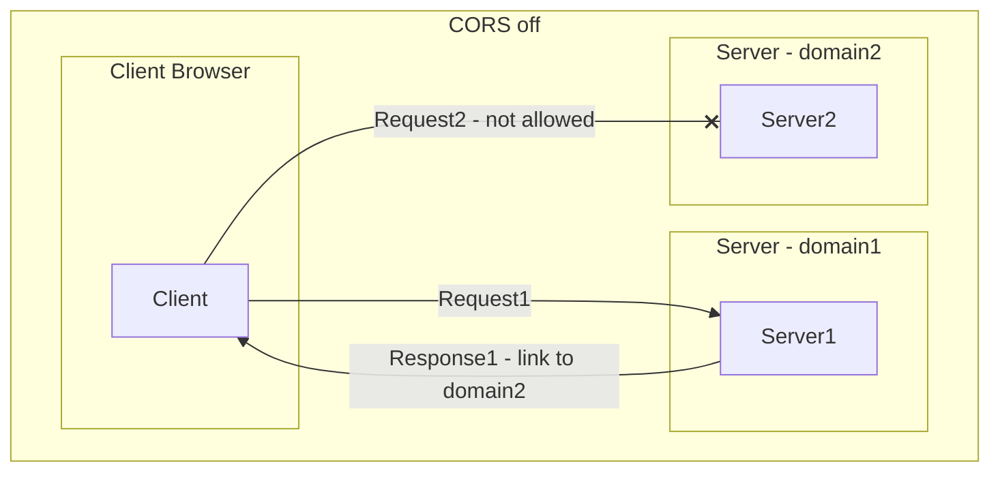
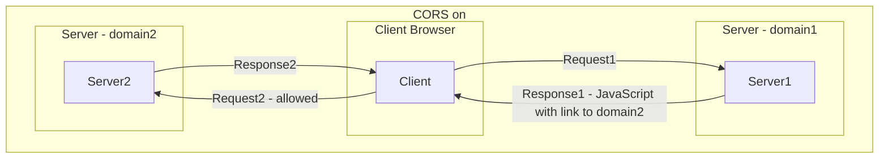
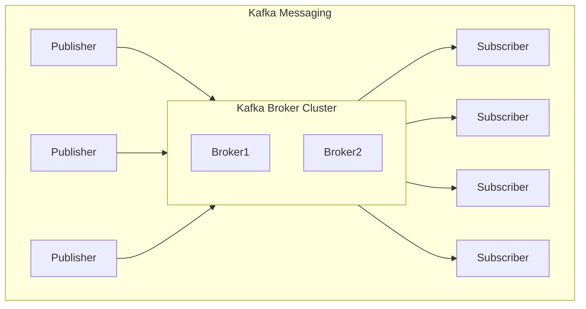
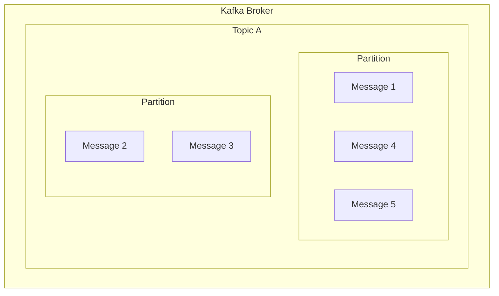
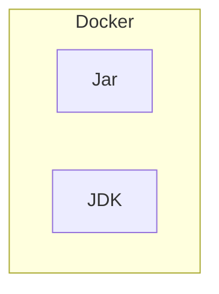

> [Home](Home.md)

# Week Two Notes

## Status : IN_PROGRESS

## Week Two Slides

- [07_Spring_Boot_Techniques](../slides/pdfs/07_Spring_Boot_Techniques.pptx.pdf)
- [08_Integrating_Data_Sources](../slides/pdfs/08_Integrating_Data_Sources.pptx.pdf)
- [09_Querying_Modifying_Entities](../slides/pdfs/09_Querying_Modifying_Entities.pptx.pdf)
- [10_Spring_Data_Repositories](../slides/pdfs/10_Spring_Data_Repositories.pptx.pdf)
- [11_Simple_Rest_Services](../slides/pdfs/11_Simple_Rest_Services.pptx.pdf)
- [12_Full_Rest_Services](../slides/pdfs/12_Full_Rest_Services.pptx.pdf)

## 07 Spring Boot Techniques

## 1. Setting App properties at the command line

Properties can be set in a `application.properties` file. These properties can then be used in the code as below

```java
@Value("${app.name}")
private String appName;
```

Can be set at many places

- Command line
- Environment variable SPRING_APPLICATION_JSON
- OS environment variables
- Application properties file outside of the jar
- Application properties file inside the jar

The topmost property will override the lower ones.

1. Specifying whichi properties file to use
2. Defining YAML properties Files
3. Using Spring profiles

On IntelliJ you can set the command line arguments as below

Run-> edit configurations -> spring boot -> Application -> Modify options-> Main class -> Program arguments

Give the command line arguments as below

```bash
--app.name=MyApp
```

Loads from `application.properties` and `application.yml` files. We can specify a specific file if we want to, but only one file will be loaded.

In Maven `java` and `resource` are on the classpath.
The properties file can be in the `resources` folder. Or it can be in a folder called `config` in the `resources` folder. However it conventionally goes in the `resources` folder.

Specify a different file as below

````bash
--spring.config.name=app2
```bash

```java
System.setProperty("spring.config.location", "app2");
````

```properties
app.name=MyApp
```

```yaml
app:
  name: MyApp
```

The properties can be injected into the code as below

```java
@Value("${app.name}")
private String appName;

@Value("${app.description}")
private String appDescription;
```

Or we can use the `@ConfigurationProperties` annotation as below, so we don't have to repeat the `@Value` annotation for each property.

```java
@ConfigurationProperties(prefix = "app")
public class AppProperties {
    private String name;
    private String description;
    // getters and setters required

}
```

Also need to specify the following in the pom.xml

```xml
<dependency>
    <groupId>org.springframework.boot</groupId>
    <artifactId>spring-boot-configuration-processor</artifactId>
    <optional>true</optional>
</dependency>


```

Project Lombok is used to generate the getters and setters. It is a Java library that automatically plugs into your editor and build tools, spicing up your java.

```java
@Data
```

## 08 Integrating with Data Sources

Starts at Week 2, 76:19 minutes

### 1. Understanding Spring Data

JPA Java Persistence API, standardization of Hibernate. Implements Object Relational Mapping (ORM).

Support of Relational DBs, NoSQL DBs, Graph DBs, Map-Reduce DBs, Cloud Datastores.

JPA is a specification over JDBC.


Use Spring attributes to set transaction.

Repository - CRUD with minimal code.

H2 is in memory database, runs inside JVM.
Dependency for H2 database. It provides the driver.

See [pom](../demos/demo-08-integrating-data-sources/pom.xml)

```xml
<dependency>
    <groupId>com.h2database</groupId>
    <artifactId>h2</artifactId>
    <scope>runtime</scope>
</dependency>
<dependency>
    <groupId>org.springframework.boot</groupId>
    <artifactId>spring-boot-starter-data-jpa</artifactId>
</dependency> pom.xml

```

Review on mvnrepository.com, copy mysql dependency if we want it.

You can use JPQL (Java Persistence Query Language) to query the database. We may have to set the dialect in `pom.xml` so it's translated to the correct SQL.

Entity class [Employee](#08-integrating-with-data-sources/)

### 2. Getting started with Spring Data JPA

### Defining JPA Entity classes

### Viewing Database Data

## 09 Querying and Modifying Entities

### 1. Querying for Entities

`@PersistenceContext` is used to inject the EntityManager into the class. It basically asks EntityManagerFactory to create an EntityManager.

2. Modifying Entities
3.

## 10 Spring Data Repositories

### 1. Understanding Spring Data Repositories

### 2. Using Spring Data Repositories

## 11 Simple Rest Services

### 1. Getting started

REST Controller is a Facade pattern. It is a class that provides a simplified interface to a complex system.

Below diagram shows the layers of the REST application. The request comes in from the client, and is handled by the controller. The controller then calls the service layer, which calls the repository layer. The repository layer then calls the database. The response is then sent back to the client.


The below diagram shows the pointers in each sublayer to the next layer. All these pointers are autowired by Spring.


The below diagram shows how the dispatcher transforms the POJO into JSON/XML.


### 2. Defining a simple REST service

## 12 Full REST service

### 1. Setting the scene

### 2. Defining a full REST service

Swagger is a tool that helps us document our REST API. It is a specification and a set of tools to help us design, build, document and consume RESTful APIs. It is equivalent to WSDL for SOAP web services.

Cross origin resource sharing (CORS) is a mechanism that allows restricted resources on a web page to be requested from another domain outside the domain from which the first resource was served.

The below diagram shows the flow, when CORS is off. The client browser is not allowed to make a request to the server in domain2.



The below diagram shows the flow, when CORS is on. The client browser is allowed to make a request to the server in domain2.



## 14 Kakfa Messaging

Below diagram shows the flow of messages between publishers and subscribers via Kafka Broker Cluster.


The below diagram shows how the kafka broker maintains partition that contains the messages. You can think of each partition as just a file. All new messages are appended to the end of the file. The broker maintains an index of the messages in the file. The index is used to find the messages quickly.

The messages are written to the disk in the order they are received. The messages are read from the disk in the order they are written. This is called the order guarantee.

A message is identified by the topic, partition and offset. The offset is the index of the message in the partition.

A message can only be written to one partition. The partition is decided by the key of the message. If the key is not specified, the partition is decided by the round robin algorithm.



### 15. Containerization



```
> [Home](HOME.md)
